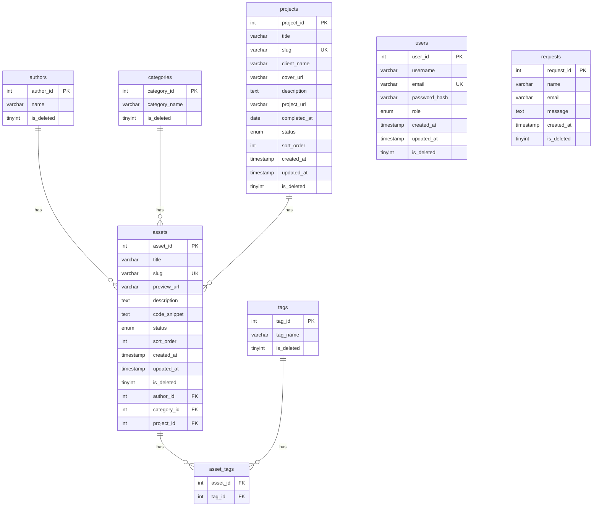

# Studio Assets Database Guide (資料庫開發指南)

本文件供開發時查詢資料庫結構與輸入規則，確保網站資料庫正規化運作。

> 💡 在 VS Code 中按 `Cmd+Shift+V`（Mac）或 `Ctrl+Shift+V`（Windows）可預覽排版與 ER Diagram。

> 📄 `schema.sql` 位於同目錄，包含完整建表 DDL，可直接在 MariaDB/MySQL 執行重建資料庫。

## 1. 資料庫關聯圖 (ER Diagram)



## 2. 資料表說明

| 表名 | 功能描述 | 對外/對內 | 核心外鍵 |
| :--- | :--- | :--- | :--- |
| `projects` | 存放對外展示的案子資訊 | 對外 | - |
| `assets` | 存放作品素材內容（管理員專用） | 對內 | `author_id`, `category_id`, `project_id` |
| `authors` | 存放作者詳細資訊 | 對內 | - |
| `categories` | 存放作品分類目錄 | 對內 | - |
| `tags` | 存放所有分類標籤 | 對內 | - |
| `asset_tags` | 連結素材與標籤 (多對多) | 對內 | `asset_id`, `tag_id` |
| `users` | 存放管理員帳號 | 系統 | - |
| `requests` | 存放訪客詢問表單紀錄 | 系統 | - |

## 3. 資料輸入標準 (Input Standards)

### 3.1 projects 欄位規範

| 欄位名稱 | 格式 | 必填 | 說明 |
| :--- | :--- | :--- | :--- |
| `title` | VARCHAR(255) | ✓ | 案子名稱 |
| `slug` | VARCHAR(255) | ✓ | URL 友善路徑，如 `brand-website-abc`。**欄位為 UNIQUE，重複會報錯** |
| `client_name` | VARCHAR(255) | - | 客戶名稱，僅後台顯示 |
| `cover_url` | VARCHAR(500) | - | 封面圖公開網址 |
| `description` | TEXT | - | 案子描述 |
| `project_url` | VARCHAR(500) | - | 成品網址 |
| `completed_at` | DATE | - | 完成日期，格式 `YYYY-MM-DD` |
| `status` | ENUM | - | 可選: `draft`（預設）, `published`, `archived`。官網只顯示 `published` 的案子 |
| `sort_order` | INT | - | 顯示排序，預設為 `0`，數字越小越前面 |

### 3.2 核心素材欄位規範

| 欄位名稱 | 格式 | 必填 | 說明 |
| :--- | :--- | :--- | :--- |
| `title` | VARCHAR(255) | ✓ | 素材完整名稱 |
| `slug` | VARCHAR(255) | ✓ | URL 友善路徑，如 `my-asset-01`。**欄位為 UNIQUE，重複會報錯** |
| `status` | ENUM | - | 可選: `draft`（預設）, `published`, `archived` |
| `sort_order` | INT | - | 顯示排序，預設為 `0`，數字越小越前面 |
| `preview_url` | VARCHAR(500) | - | 圖片資源的公開存取網址 |
| `description` | TEXT | - | 素材描述 |
| `code_snippet` | TEXT | - | 相關代碼區塊 |
| `author_id` | INT | - | 對應 `authors.author_id`，允許為 NULL |
| `category_id` | INT | - | 對應 `categories.category_id`，允許為 NULL |
| `project_id` | INT | - | 對應 `projects.project_id`，允許為 NULL（素材可獨立存在） |

### 3.3 管理欄位 (自動處理)

* `created_at` / `updated_at`：由系統自動填入，不需人工手動輸入。
* `is_deleted`：軟刪除旗標，請勿物理刪除資料。`0` 為啟用，`1` 為刪除。**所有查詢都必須加上 `WHERE is_deleted = 0`，否則會撈到已刪除資料。** 所有表同樣須過濾（`requests` 除外，詢問表單通常只查新增不查刪除）。

## 4. 常用 SQL 查詢參考

### 4.1 查詢所有對外公開案子

```sql
SELECT *
FROM projects
WHERE is_deleted = 0
  AND status = 'published'
ORDER BY sort_order ASC;
```

### 4.2 查詢完整素材資訊（含關聯）

```sql
SELECT
    assets.*,
    authors.name AS author_name,
    categories.category_name,
    projects.title AS project_title,
    GROUP_CONCAT(tags.tag_name) AS tags_list
FROM assets
LEFT JOIN authors ON assets.author_id = authors.author_id
LEFT JOIN categories ON assets.category_id = categories.category_id
LEFT JOIN projects ON assets.project_id = projects.project_id
LEFT JOIN asset_tags ON assets.asset_id = asset_tags.asset_id
LEFT JOIN tags ON asset_tags.tag_id = tags.tag_id
WHERE assets.is_deleted = 0
GROUP BY assets.asset_id;
```

## 5. 查詢現有參考資料 (Reference Data Lookup)

新增資料前，請先確認可用的 ID：

```sql
SELECT author_id, name FROM authors WHERE is_deleted = 0;
SELECT category_id, category_name FROM categories WHERE is_deleted = 0;
SELECT tag_id, tag_name FROM tags WHERE is_deleted = 0;
SELECT project_id, title, client_name FROM projects WHERE is_deleted = 0;
```

## 6. 開發者須知 (Developer Notes)

### 6.1 寫入順序 (Insertion Sequence)

由於存在外鍵關聯，新增資料時請嚴格遵守下列順序，否則將觸發 1452 錯誤：

1. `authors`
2. `categories`
3. `tags`
4. `projects`
5. `assets`
6. `asset_tags`（最後連結）

`users` 和 `requests` 無外鍵，可隨時新增。

### 6.2 交易處理原則 (Transaction Policy)

為避免操作失敗導致資料殘缺，所有多表寫入動作請務必包裝在交易語句中：

```sql
START TRANSACTION;
-- 執行你的 INSERT 指令
COMMIT; -- 確認無誤後提交
-- 若過程中報錯，請務必執行下方指令清空暫存：
ROLLBACK;
```

### 6.3 常用除錯檢查 (Troubleshooting)

若遇到 `Foreign Key Constraint Fails (Error 1452)`：

* 第一步：執行 `ROLLBACK;` 清除當前失敗的交易。
* 第二步：確認目標父表（如 `projects`）中是否確實已存在對應的 `ID`。
* 第三步：使用 `SELECT` 語句確認最新 ID（注意：`AUTO_INCREMENT` 會因失敗紀錄而跳號，請勿假設 ID 永遠從 1 開始）。

### 6.4 快速實作範本 (Mock Data)

```sql
START TRANSACTION;

-- 1. 新增案子
INSERT INTO projects (title, slug, client_name, status)
VALUES ('品牌官網範例', 'brand-website-example', '範例客戶', 'published');

-- 2. 新增素材並關聯至案子
INSERT INTO assets (title, slug, author_id, category_id, project_id, status, description)
VALUES ('首頁截圖', 'homepage-screenshot', 1, 1, LAST_INSERT_ID(), 'published', '首頁設計截圖');

-- 3. 建立標籤關聯
INSERT INTO asset_tags (asset_id, tag_id)
VALUES (LAST_INSERT_ID(), 1);

COMMIT;
```