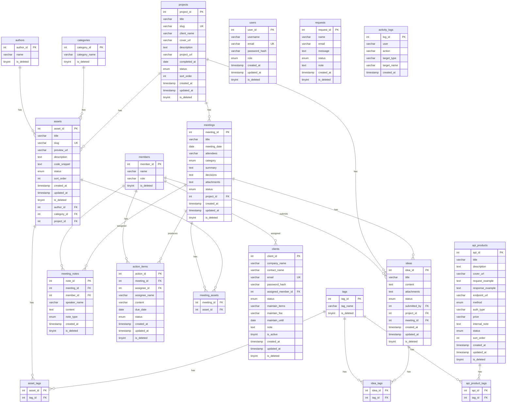

# Studio Assets Database Guide (資料庫開發指南)

本文件供開發時查詢資料庫結構與輸入規則，確保網站資料庫正規化運作。

> 💡 在 VS Code 中按 `Cmd+Shift+V`（Mac）或 `Ctrl+Shift+V`（Windows）可預覽排版與 ER Diagram。

> 📄 `schema.sql` 位於同目錄，包含完整建表 DDL，可直接在 MariaDB/MySQL 執行重建資料庫。

---

## 1. 資料庫關聯圖 (ER Diagram)



---

## 2. 資料表說明

| 表名 | 功能描述 | 對外/對內 | 核心外鍵 |
| :--- | :--- | :--- | :--- |
| `projects` | 存放對外展示的案子資訊 | 對外 | - |
| `assets` | 存放作品素材內容（管理員專用） | 對內 | `author_id`, `category_id`, `project_id` |
| `authors` | 存放作者詳細資訊 | 對內 | - |
| `categories` | 存放作品分類目錄 | 對內 | - |
| `tags` | 存放所有分類標籤（全系統共用） | 對內 | - |
| `asset_tags` | 連結素材與標籤 (多對多) | 對內 | `asset_id`, `tag_id` |
| `users` | 存放管理員帳號 | 系統 | - |
| `requests` | 存放訪客詢問表單紀錄，含狀態與備註 | 系統 | - |
| `members` | 工作室成員（獨立於素材系統） | 對內 | - |
| `meetings` | 會議主表，記錄基本資訊與最終決議 | 對內 | `project_id` |
| `meeting_notes` | 發言記錄，記錄誰說了什麼 | 對內 | `meeting_id`, `member_id` |
| `action_items` | 從會議產出的待辦事項 | 對內 | `meeting_id`, `assignee_id` |
| `meeting_assets` | 連結會議與素材 (多對多) | 對內 | `meeting_id`, `asset_id` |
| `clients` | 外部客戶帳號，含合作狀態與維護資訊 | 系統 | `assigned_member_id` |
| `api_products` | API 商品目錄，部分欄位僅內部可見 | 對外/對內 | - |
| `api_product_tags` | 連結 API 商品與標籤 (多對多) | 對內 | `api_id`, `tag_id` |
| `ideas` | 內部點子便利貼，存放草稿想法 | 對內 | `submitted_by`, `project_id`, `meeting_id` |
| `idea_tags` | 連結點子與標籤 (多對多) | 對內 | `idea_id`, `tag_id` |
| `activity_logs` | 系統操作日誌，記錄誰在何時做了什麼 | 系統 | - |

---

## 3. 資料輸入標準 (Input Standards)

### 3.1 projects 欄位規範

| 欄位名稱 | 格式 | 必填 | 說明 |
| :--- | :--- | :--- | :--- |
| `title` | VARCHAR(255) | ✓ | 案子名稱 |
| `slug` | VARCHAR(255) | ✓ | URL 友善路徑，如 `brand-website-abc`。**欄位為 UNIQUE，重複會報錯** |
| `client_name` | VARCHAR(255) | - | 客戶名稱，僅後台顯示 |
| `cover_url` | VARCHAR(500) | - | 封面圖公開網址 |
| `description` | TEXT | - | 案子描述 |
| `project_url` | VARCHAR(500) | - | 成品網址 |
| `completed_at` | DATE | - | 完成日期，格式 `YYYY-MM-DD` |
| `status` | ENUM | - | 可選: `draft`（預設）, `published`, `archived`。官網只顯示 `published` 的案子 |
| `sort_order` | INT | - | 顯示排序，預設為 `0`，數字越小越前面 |

### 3.2 核心素材欄位規範

| 欄位名稱 | 格式 | 必填 | 說明 |
| :--- | :--- | :--- | :--- |
| `title` | VARCHAR(255) | ✓ | 素材完整名稱 |
| `slug` | VARCHAR(255) | ✓ | URL 友善路徑，如 `my-asset-01`。**欄位為 UNIQUE，重複會報錯** |
| `status` | ENUM | - | 可選: `draft`（預設）, `published`, `archived` |
| `sort_order` | INT | - | 顯示排序，預設為 `0`，數字越小越前面 |
| `preview_url` | VARCHAR(500) | - | 圖片資源的公開存取網址 |
| `description` | TEXT | - | 素材描述 |
| `code_snippet` | TEXT | - | 相關代碼區塊 |
| `author_id` | INT | - | 對應 `authors.author_id`，允許為 NULL |
| `category_id` | INT | - | 對應 `categories.category_id`，允許為 NULL |
| `project_id` | INT | - | 對應 `projects.project_id`，允許為 NULL（素材可獨立存在） |

### 3.3 會議模組欄位規範

| 欄位名稱 | 格式 | 必填 | 說明 |
| :--- | :--- | :--- | :--- |
| `title` | VARCHAR(255) | ✓ | 會議主題 |
| `meeting_date` | DATE | ✓ | 會議日期，格式 `YYYY-MM-DD` |
| `attendees` | VARCHAR(500) | - | 與會人員，逗號分隔，如 `Paul, Oreo, Joseph` |
| `category` | ENUM | - | `專案討論`, `客戶會議`, `例行週會`, `腦力激盪`, `其他`（預設）。前台目前不顯示，保留供後端使用 |
| `summary` | TEXT | - | 會議討論重點，條列式記錄 |
| `decisions` | TEXT | - | 最終結論，最重要的欄位 |
| `attachments` | TEXT | - | 附件或連結，多個用換行分隔 |
| `status` | ENUM | - | `scheduled`（預設）, `done`, `cancelled` |
| `project_id` | INT | - | 對應 `projects.project_id`，允許為 NULL |

**action_items 欄位：**

| 欄位名稱 | 格式 | 必填 | 說明 |
| :--- | :--- | :--- | :--- |
| `meeting_id` | INT | ✓ | 對應 `meetings.meeting_id` |
| `assignee_id` | INT | - | 對應 `members.member_id`，允許為 NULL |
| `assignee_name` | VARCHAR(100) | - | 負責人姓名，搭配 `assignee_id` 使用 |
| `content` | VARCHAR(500) | ✓ | 待辦事項內容 |
| `due_date` | DATE | - | 截止日期，格式 `YYYY-MM-DD` |
| `status` | ENUM | - | `未開始`（預設）, `進行中`, `已完成`, `已取消` |

### 3.4 clients 欄位規範

> ⚠️ `clients` 是外部客戶帳號，與內部 `members` 不同。客戶登入後只能瀏覽 `published` 的 API 商品。

| 欄位名稱 | 格式 | 必填 | 說明 |
| :--- | :--- | :--- | :--- |
| `contact_name` | VARCHAR(100) | ✓ | 聯絡人姓名 |
| `email` | VARCHAR(255) | ✓ | 登入帳號。**欄位為 UNIQUE，重複會報錯** |
| `password_hash` | VARCHAR(255) | ✓ | 雜湊後的密碼，請勿存明文 |
| `company_name` | VARCHAR(255) | - | 公司名稱 |
| `assigned_member_id` | INT | - | 負責對接的內部成員，對應 `members.member_id` |
| `status` | ENUM | - | `active`（合作中，預設）, `maintaining`（維護中）, `ended`（合作結束） |
| `maintain_items` | VARCHAR(500) | - | 維護項目說明，僅 `status = maintaining` 時填寫，如 `網站更新、主機管理` |
| `maintain_fee` | VARCHAR(100) | - | 維護月費，如 `NT$ 3,000 / 月` |
| `maintain_until` | DATE | - | 維護合約到期日，格式 `YYYY-MM-DD`。Dashboard 會在到期前 30 天顯示警示 |
| `note` | TEXT | - | 內部備註 |
| `is_active` | TINYINT | - | 帳號登入權限，`1` 為啟用（預設），`0` 為暫停。與 `status` 不同，專門控制能否登入 |

### 3.5 api_products 欄位規範

> ⚠️ 欄位分為對外可見與純內部兩種，前端串接時請注意不要將內部欄位暴露給 client。

**對外可見欄位（登入的 client 可以看到）：**

| 欄位名稱 | 格式 | 必填 | 說明 |
| :--- | :--- | :--- | :--- |
| `title` | VARCHAR(255) | ✓ | API 名稱 |
| `description` | TEXT | - | 功能說明 |
| `cover_url` | VARCHAR(500) | - | 展示用封面圖網址 |
| `request_example` | TEXT | - | 請求範例 |
| `response_example` | TEXT | - | 回應範例 |
| `status` | ENUM | - | `draft`（預設）, `published`, `archived`。**client 只看得到 `published` 的項目** |
| `sort_order` | INT | - | 顯示排序，預設為 `0`，數字越小越前面 |

**純內部欄位（僅後台管理員可見）：**

| 欄位名稱 | 格式 | 必填 | 說明 |
| :--- | :--- | :--- | :--- |
| `endpoint_url` | VARCHAR(500) | - | API 實際端點網址，供內部測試使用 |
| `method` | ENUM | - | 請求方法：`GET`, `POST`, `PUT`, `DELETE` |
| `auth_type` | VARCHAR(100) | - | 驗證方式，如 `API Key`, `Bearer Token` |
| `price` | VARCHAR(100) | - | 價格，預設為 `待決定` |
| `internal_note` | TEXT | - | 內部備註 |

### 3.6 requests 欄位規範

| 欄位名稱 | 格式 | 必填 | 說明 |
| :--- | :--- | :--- | :--- |
| `name` | VARCHAR(255) | ✓ | 詢問者姓名 |
| `email` | VARCHAR(255) | ✓ | 詢問者 Email |
| `message` | TEXT | ✓ | 詢問內容 |
| `status` | ENUM | - | `new`（新進，預設）, `read`（已讀）, `replied`（已回覆）。後台手動切換 |
| `note` | TEXT | - | 內部備註，僅後台可見，用於記錄跟進狀況 |

### 3.7 ideas 欄位規範

| 欄位名稱 | 格式 | 必填 | 說明 |
| :--- | :--- | :--- | :--- |
| `title` | VARCHAR(255) | ✓ | 點子標題 |
| `content` | TEXT | - | 詳細描述或想法內容 |
| `attachments` | TEXT | - | 附件或參考連結，多個用換行分隔 |
| `status` | ENUM | - | `新點子`（預設）, `討論中`, `已採用`, `已放棄` |
| `submitted_by` | INT | - | 提出者，對應 `members.member_id`，允許為 NULL |
| `project_id` | INT | - | 關聯案子，允許為 NULL（點子可獨立存在） |
| `meeting_id` | INT | - | 來自哪場會議，允許為 NULL（點子可獨立冒出） |

### 3.8 activity_logs 欄位規範

> ⚠️ 此表日誌內容由後端在每次 CRUD 操作時自動寫入，前端不得手動新增或刪除日誌。唯一允許的前端寫入為 `note` 欄位（人工備注）。

| 欄位名稱 | 格式 | 必填 | 說明 |
| :--- | :--- | :--- | :--- |
| `user` | VARCHAR(100) | ✓ | 操作者名稱，來自登入的 `users.username` |
| `action` | VARCHAR(50) | ✓ | 操作類型，如 `新增`, `編輯`, `刪除`, `狀態變更` |
| `target_type` | VARCHAR(50) | ✓ | 操作對象類型，如 `Projects`, `Clients`, `Ideas` |
| `target_name` | VARCHAR(255) | - | 操作對象名稱，如專案標題、客戶公司名稱 |
| `note` | VARCHAR(500) | - | 人工備注，用於補充說明或標記誤操作，可由前端編輯 |
| `created_at` | TIMESTAMP | - | 操作時間，由系統自動填入 |

### 3.9 管理欄位 (自動處理)

- `created_at` / `updated_at`：由系統自動填入，不需人工手動輸入。
- `is_deleted`：軟刪除旗標，請勿物理刪除資料。`0` 為啟用，`1` 為刪除。**所有查詢都必須加上 `WHERE is_deleted = 0`，否則會撈到已刪除資料。**
- `is_active`（僅 `clients` 表）：帳號登入權限旗標，與 `is_deleted` 職責不同。查詢可登入的 client 時需同時過濾：`WHERE is_deleted = 0 AND is_active = 1`。

---

## 4. 常用 SQL 查詢參考

### 4.1 查詢所有對外公開案子

```sql
SELECT *
FROM projects
WHERE is_deleted = 0
  AND status = 'published'
ORDER BY sort_order ASC;
```

### 4.2 查詢完整素材資訊（含關聯）

```sql
SELECT
    assets.*,
    authors.name AS author_name,
    categories.category_name,
    projects.title AS project_title,
    GROUP_CONCAT(tags.tag_name) AS tags_list
FROM assets
LEFT JOIN authors ON assets.author_id = authors.author_id
LEFT JOIN categories ON assets.category_id = categories.category_id
LEFT JOIN projects ON assets.project_id = projects.project_id
LEFT JOIN asset_tags ON assets.asset_id = asset_tags.asset_id
LEFT JOIN tags ON asset_tags.tag_id = tags.tag_id
WHERE assets.is_deleted = 0
GROUP BY assets.asset_id;
```

### 4.3 查詢某場會議的決議與待辦

```sql
-- 會議基本資訊與結論
SELECT title, meeting_date, attendees, summary, decisions, status
FROM meetings
WHERE meeting_id = 1 AND is_deleted = 0;

-- 該場待辦事項
SELECT content, assignee_name, due_date, status
FROM action_items
WHERE meeting_id = 1 AND is_deleted = 0
ORDER BY due_date ASC;
```

### 4.4 查詢所有未完成待辦（跨會議，Dashboard 用）

```sql
SELECT
    a.content,
    a.assignee_name,
    a.due_date,
    a.status,
    m.title AS meeting_title,
    m.meeting_date
FROM action_items a
JOIN meetings m ON a.meeting_id = m.meeting_id
WHERE a.status NOT IN ('已完成', '已取消')
  AND a.is_deleted = 0
  AND m.is_deleted = 0
ORDER BY a.due_date ASC;
```

### 4.5 查詢 30 天內到期的維護合約（Dashboard 警示用）

```sql
SELECT
    client_id,
    company_name,
    contact_name,
    maintain_until,
    maintain_items,
    maintain_fee
FROM clients
WHERE is_deleted = 0
  AND status = 'maintaining'
  AND maintain_until BETWEEN CURDATE() AND DATE_ADD(CURDATE(), INTERVAL 30 DAY)
ORDER BY maintain_until ASC;
```

### 4.6 查詢 API 商品清單（對外，client 視角）

```sql
SELECT
    api_products.api_id,
    api_products.title,
    api_products.description,
    api_products.cover_url,
    api_products.request_example,
    api_products.response_example,
    api_products.sort_order,
    GROUP_CONCAT(tags.tag_name) AS tags_list
FROM api_products
LEFT JOIN api_product_tags ON api_products.api_id = api_product_tags.api_id
LEFT JOIN tags ON api_product_tags.tag_id = tags.tag_id
WHERE api_products.is_deleted = 0
  AND api_products.status = 'published'
GROUP BY api_products.api_id
ORDER BY api_products.sort_order ASC;
```

### 4.7 查詢 API 商品完整資訊（內部後台視角）

```sql
SELECT
    api_products.*,
    GROUP_CONCAT(tags.tag_name) AS tags_list
FROM api_products
LEFT JOIN api_product_tags ON api_products.api_id = api_product_tags.api_id
LEFT JOIN tags ON api_product_tags.tag_id = tags.tag_id
WHERE api_products.is_deleted = 0
GROUP BY api_products.api_id
ORDER BY api_products.sort_order ASC;
```

### 4.8 查詢所有啟用中的 clients

```sql
SELECT
    client_id,
    company_name,
    contact_name,
    email,
    status,
    maintain_until,
    members.name AS assigned_to,
    is_active,
    created_at
FROM clients
LEFT JOIN members ON clients.assigned_member_id = members.member_id
WHERE clients.is_deleted = 0
  AND clients.is_active = 1
ORDER BY clients.created_at DESC;
```

### 4.9 查詢所有點子（含來源）

```sql
SELECT
    ideas.idea_id,
    ideas.title,
    ideas.content,
    ideas.status,
    members.name AS submitted_by_name,
    projects.title AS project_title,
    meetings.title AS meeting_title,
    GROUP_CONCAT(tags.tag_name) AS tags_list,
    ideas.created_at
FROM ideas
LEFT JOIN members ON ideas.submitted_by = members.member_id
LEFT JOIN projects ON ideas.project_id = projects.project_id
LEFT JOIN meetings ON ideas.meeting_id = meetings.meeting_id
LEFT JOIN idea_tags ON ideas.idea_id = idea_tags.idea_id
LEFT JOIN tags ON idea_tags.tag_id = tags.tag_id
WHERE ideas.is_deleted = 0
GROUP BY ideas.idea_id
ORDER BY ideas.created_at DESC;
```

### 4.10 查詢新進未讀 Requests（Dashboard 用）

```sql
SELECT request_id, name, email, message, created_at
FROM requests
WHERE is_deleted = 0
  AND status = 'new'
ORDER BY created_at DESC;
```

### 4.11 查詢系統操作日誌

```sql
-- 全部日誌（最新在前）
SELECT log_id, user, action, target_type, target_name, created_at
FROM activity_logs
ORDER BY created_at DESC;

-- 篩選特定操作者
SELECT * FROM activity_logs
WHERE user = 'Paul'
ORDER BY created_at DESC;

-- 篩選特定模組
SELECT * FROM activity_logs
WHERE target_type = 'Clients'
ORDER BY created_at DESC;

-- 日期範圍篩選
SELECT * FROM activity_logs
WHERE created_at BETWEEN '2026-06-01' AND '2026-06-30'
ORDER BY created_at DESC;
```

---

## 5. 查詢現有參考資料 (Reference Data Lookup)

新增資料前，請先確認可用的 ID：

```sql
SELECT author_id, name FROM authors WHERE is_deleted = 0;
SELECT category_id, category_name FROM categories WHERE is_deleted = 0;
SELECT tag_id, tag_name FROM tags WHERE is_deleted = 0;
SELECT project_id, title, client_name FROM projects WHERE is_deleted = 0;
SELECT member_id, name, role FROM members WHERE is_deleted = 0;
SELECT client_id, company_name, contact_name, email, status FROM clients WHERE is_deleted = 0;
SELECT api_id, title, status FROM api_products WHERE is_deleted = 0;
SELECT idea_id, title, status FROM ideas WHERE is_deleted = 0;
SELECT meeting_id, title, meeting_date, status FROM meetings WHERE is_deleted = 0;
SELECT log_id, user, action, target_type, created_at FROM activity_logs ORDER BY created_at DESC LIMIT 20;
```

---

## 6. 開發者須知 (Developer Notes)

### 6.1 寫入順序 (Insertion Sequence)

由於存在外鍵關聯，新增資料時請嚴格遵守下列順序，否則將觸發 1452 錯誤：

**素材系統：**
1. `authors`
2. `categories`
3. `tags`
4. `projects`
5. `assets`
6. `asset_tags`

**會議模組：**
1. `members`
2. `meetings`
3. `meeting_notes`
4. `action_items`
5. `meeting_assets`

**API 商品模組：**
1. `tags`（已存在則跳過）
2. `api_products`
3. `api_product_tags`

**點子模組：**
1. `members`（已存在則跳過）
2. `projects`（已存在則跳過，點子可不關聯）
3. `meetings`（已存在則跳過，點子可不關聯）
4. `ideas`
5. `idea_tags`

**Client 帳號：**
1. `members`（已存在則跳過）
2. `clients`

`users` 和 `requests` 無外鍵，可隨時新增。`activity_logs` 由後端自動寫入，不需手動處理。

### 6.2 交易處理原則 (Transaction Policy)

為避免操作失敗導致資料殘缺，所有多表寫入動作請務必包裝在交易語句中：

```sql
START TRANSACTION;
-- 執行你的 INSERT 指令
COMMIT;
-- 若過程中報錯，請務必執行下方指令清空暫存：
ROLLBACK;
```

### 6.3 常用除錯檢查 (Troubleshooting)

若遇到 `Foreign Key Constraint Fails (Error 1452)`：

1. 執行 `ROLLBACK;` 清除當前失敗的交易
2. 確認目標父表（如 `projects`）中是否確實已存在對應的 ID
3. 使用 `SELECT` 語句確認最新 ID（注意：`AUTO_INCREMENT` 會因失敗紀錄而跳號，請勿假設 ID 永遠從 1 開始）

### 6.4 api_products 欄位可見性提醒

前端開發串接 API 商品清單時，**絕對不可將以下欄位回傳給 client**：

- `endpoint_url`
- `method`
- `auth_type`
- `price`
- `internal_note`

建議在後端 API 路由層明確指定 SELECT 欄位，而非直接回傳整筆資料。

### 6.5 前端與 DB 狀態值對照表

串接後端時注意以下欄位的狀態值定義：

| 模組 | 欄位 | 前端值 | DB 值 | 說明 |
| :--- | :--- | :--- | :--- | :--- |
| Meetings | status | `scheduled` / `done` / `cancelled` | 同左 | 已對齊 |
| Ideas | status | `新點子` / `討論中` / `已採用` / `已放棄` | 同左 | 已對齊 |
| Clients | status | `active` / `maintaining` / `ended` | 同左 | 已對齊 |
| Requests | status | `new` / `read` / `replied` | 同左 | 已對齊 |
| Projects | status | `draft` / `published` / `archived` | 同左 | 已對齊 |
| API Products | status | `draft` / `published` / `archived` | 同左 | 已對齊 |
| Assets | status | `draft` / `published` / `archived` | 同左 | 已對齊 |

---

## 7. 快速實作範本 (Mock Data)

### 7.1 素材系統

```sql
START TRANSACTION;

INSERT INTO projects (title, slug, client_name, status)
VALUES ('品牌官網範例', 'brand-website-example', '範例客戶', 'published');

SET @project_id = LAST_INSERT_ID();
INSERT INTO assets (title, slug, author_id, category_id, project_id, status, description)
VALUES ('首頁截圖', 'homepage-screenshot', 1, 1, @project_id, 'published', '首頁設計截圖');

INSERT INTO asset_tags (asset_id, tag_id)
VALUES (LAST_INSERT_ID(), 1);

COMMIT;
```

### 7.2 會議記錄

```sql
START TRANSACTION;

INSERT INTO meetings (title, meeting_date, attendees, summary, decisions, status, project_id)
VALUES (
  '築本官網首頁設計討論',
  '2026-06-15',
  'Paul, Oreo, Joseph',
  '- 討論首頁視覺方向\n- 確認三欄 Hero 結構',
  '決定採用深藍色調，首頁分三區塊：Hero、作品集、聯絡表單。',
  'done',
  1
);

SET @mid = LAST_INSERT_ID();

INSERT INTO action_items (meeting_id, assignee_id, assignee_name, content, due_date)
VALUES
  (@mid, 2, 'Oreo', '提供首頁視覺稿（3 個方向）', '2026-06-22'),
  (@mid, 1, 'Paul', '整理競品參考連結', '2026-06-18');

COMMIT;
```

### 7.3 API 商品

```sql
START TRANSACTION;

INSERT INTO api_products (
  title, description, cover_url,
  request_example, response_example,
  endpoint_url, method, auth_type,
  price, status, sort_order
)
VALUES (
  '自動報價單產生器',
  '輸入材料與工時，自動輸出結構化報價單',
  'https://example.com/cover.jpg',
  '{"materials": [...], "hours": 10}',
  '{"pdf_url": "https://..."}',
  'https://api.example.com/v1/quote',
  'POST',
  'Bearer Token',
  'NT$ 2,000 / 月',
  'published',
  1
);

INSERT INTO api_product_tags (api_id, tag_id)
VALUES (LAST_INSERT_ID(), 1);

COMMIT;
```

### 7.4 點子

```sql
START TRANSACTION;

-- 獨立點子
INSERT INTO ideas (title, content, status, submitted_by)
VALUES (
  '自動產生客戶月報 API',
  '每月自動抓取專案進度，產生 PDF 月報寄給客戶，減少人工整理時間',
  '新點子',
  1
);

-- 來自某場會議的點子
INSERT INTO ideas (title, content, status, submitted_by, meeting_id)
VALUES (
  'Hero 動畫效果討論',
  '考慮用 GSAP 做滾動觸發動畫，參考競品 A 的做法',
  '討論中',
  2,
  1
);

COMMIT;
```

### 7.5 Client 帳號

```sql
-- 合作中客戶
INSERT INTO clients (company_name, contact_name, email, password_hash, assigned_member_id, status, note)
VALUES (
  '裕達科技',
  '李專員',
  'li@yuda.com.tw',
  '$2b$10$hashedpasswordhere',
  1,
  'active',
  'API 報價系統開發中'
);

-- 維護中客戶
INSERT INTO clients (company_name, contact_name, email, password_hash, assigned_member_id, status, maintain_items, maintain_fee, maintain_until, note)
VALUES (
  '得嘉野餐廳',
  '王老闆',
  'dejia@example.com',
  '$2b$10$hashedpasswordhere',
  1,
  'maintaining',
  '網站更新、主機管理、Facebook 粉絲數同步',
  'NT$ 3,000 / 月',
  '2026-12-31',
  '官網建置完成，目前月費維護中'
);
```

### 7.6 Requests 狀態更新

```sql
-- 標記為已讀
UPDATE requests SET status = 'read' WHERE request_id = 1;

-- 標記為已回覆並加備註
UPDATE requests
SET status = 'replied', note = '已寄報價單，等待回覆'
WHERE request_id = 2;
```